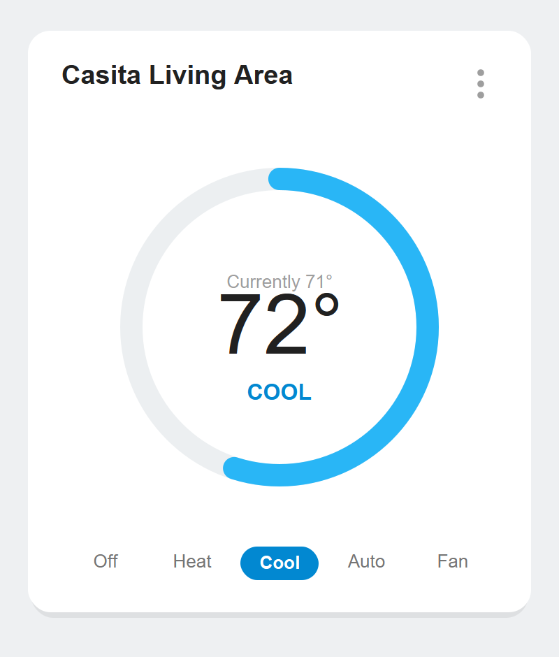
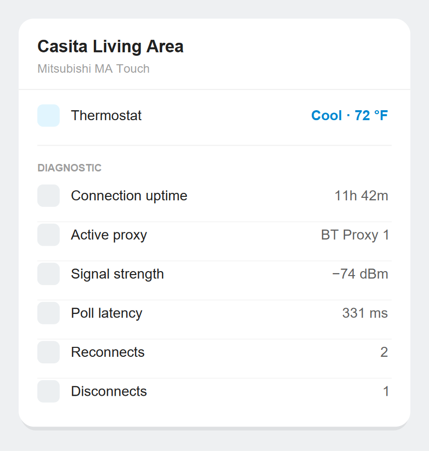

# Mitsubishi MA Touch for Home Assistant

[![hacs][hacs-badge]][hacs]
[![GitHub Release][release-badge]][releases]

A Home Assistant integration for **Mitsubishi MA Touch** wired thermostat
controllers (**PAR-CT01MAU**) over **Bluetooth LE** — fully local, no Kumo Cloud,
no MELRemo app, no internet. It's built to run **several thermostats at once,
24/7**, across **ESP32 Bluetooth proxies**, with persistent connections and
self-healing recovery.

Developed and run against **five units** (4× `PAR-CT01MAU` + 1× `PAR-CT01MA`)
spread across a building on two ESP32 proxies.

It focuses on doing a few things well:

- 🌡️ **Full climate control** — HVAC mode (off / auto / heat / cool / dry /
  fan-only), heat & cool setpoints (incl. auto-mode range), fan speed
  (auto / low / medium / high / quiet), and vane swing (on/off).
- 🔗 **Persistent BLE connections** — a lightweight keepalive holds the link open
  so each poll is a single status read instead of a full reconnect + login.
- 📡 **Multi-proxy load balancing** — connections are spread across your ESP32
  Bluetooth proxies (least-loaded reachable proxy per device), and **rebalanced
  automatically** as proxies come and go.
- 🩺 **Diagnostic telemetry** — per-thermostat connection uptime, reconnects,
  latency, serving proxy and link RSSI, plus a service to export raw event data.
- ➕ **Add several at once, manage individually** — scan-and-multiselect to add a
  batch; add or remove a thermostat later without disturbing the others.
- 🇺🇸 **Correct Fahrenheit** — uses Mitsubishi's own °F lookup table so the Home
  Assistant card matches the physical controller exactly (no off-by-one).

  

The Home Assistant thermostat card for one MA Touch unit — whole-°F setpoints that match the physical controller.

## Why Bluetooth?

MA Touch controllers are a **wired MA-bus** accessory; their only local, cloudless
control path is **Bluetooth LE** (the same one the MELRemo app uses). The
alternative — Kumo Cloud — means an internet dependency, extra wiring/adapters,
and a vendor account. This integration talks to each controller directly over BLE:

- **Local and private** — state and commands never leave your network.
- **No app, no cloud account** — just the PIN from the thermostat's settings.
- **Scales over your LAN** — because the BLE link is reached through **ESP32
  Bluetooth proxies**, the thermostats don't have to be near the Home Assistant
  host; the integration shares the proxy radios across all of them.

## Requirements

- **Home Assistant 2025.3 or newer.** The integration uses **config subentries**
  (one parent entry, one removable “thermostat” subentry per device), which that
  release introduced. HACS enforces the minimum; developed/run on 2026.6.
- **A Bluetooth transport that can reach your thermostats** — see
  [Before you start](#before-you-start). One or more **ESP32 Bluetooth proxies**
  (ESPHome `bluetooth_proxy`, *active* mode) is the recommended setup for more than
  a unit or two; a local HA Bluetooth adapter also works for nearby thermostats.
- **Each thermostat's PIN** — revealed in the controller's **Settings → Bluetooth**
  after you enable Bluetooth on it (see [Before you start](#before-you-start)).
- The protocol library (`construct`, `construct-typing`) is pulled in
  automatically; nothing to install by hand.

## Supported devices

| Model | Status |
|---|---|
| **PAR-CT01MAU** | ✅ Verified (4 units) |
| **PAR-CT01MA** | ✅ Verified (1 unit) — a slightly longer status frame; the fields the integration uses decode identically |
| Other MA Touch (`M/R_CT01MA*`) controllers | Expected to work (same BLE protocol) — please [open an issue][issues] if you try one |

> The library is a community reverse-engineering of the MA Touch BLE protocol, not
> an official Mitsubishi API. The wire protocol is **Celsius-native** in 0.5 °C
> steps; everything else (including °F) is handled on the Home Assistant side.

## Before you start

You need two things: each thermostat's **Bluetooth enabled and its PIN noted**, and
a **Bluetooth path** from Home Assistant to the thermostats.

### 1. Enable Bluetooth on each thermostat and get its PIN

Out of the box, MA Touch controllers don't expose Bluetooth — turn it on once per
unit, which also reveals the PIN the integration needs:

1. On the thermostat, open the **administrative / installer settings** (default
   programming code **`0000`**) and **enable Bluetooth**.
2. Back out to **Settings → Bluetooth**. The **PIN** is shown there, alongside the
   controller's **Bluetooth MAC address** — note the MAC too; it makes labeling
   which Home Assistant device is which much easier.
3. Afterwards the PIN is also reachable from the **🔑 key icon** that appears on the
   thermostat's home screen — but **Settings → Bluetooth** is preferred because it
   lists the MAC right next to the PIN.

You enter this PIN (and choose a name) per-thermostat when adding it in Home
Assistant.

### 2. Give Home Assistant Bluetooth reach to the thermostats

MA Touch controllers advertise quietly and their control service is **GATT-only
(not advertised)**, so they need a *connectable* Bluetooth path:

- **Recommended — ESP32 Bluetooth proxies** (see [Bluetooth proxies](#bluetooth-proxies)
  for sourcing, quantity, flashing, updates, and adding them to HA). They put a
  radio near the controllers and let the integration load-balance and fail over
  across them — this is the tested setup.
- **Or a local adapter** — a built-in/USB Bluetooth adapter on the HA host works
  for one or two thermostats within radio range.

## Bluetooth proxies

The integration holds **one persistent BLE connection per thermostat** and shares
your Bluetooth proxies across all of them. For anything beyond a unit or two within
radio range of the Home Assistant host, **ESP32 Bluetooth proxies are the
recommended (and tested) transport** — they place a radio near the controllers and
let the integration load-balance and fail over across them.

> Bluetooth proxies are shared Home Assistant infrastructure, not part of this
> integration. You set them up once in HA (below); this integration then discovers
> and uses them automatically — there is nothing proxy-related to configure here.

### How many you need

Each ESPHome proxy in **active** mode reliably holds **~3 concurrent connections**,
and the integration uses **one per thermostat**. Size it at roughly **one proxy per
2–3 thermostats**, then add one extra for headroom and redundancy:

| Thermostats | Proxies |
|---|---|
| 1–3 | 1 (2 for redundancy) |
| 4–6 | 2 minimum, **3 recommended** |
| 7–9 | 3 minimum, 4 recommended |

The spare proxy means losing one doesn't take a thermostat offline — the
integration rebalances onto the survivors and recovers on its own.

### Sourcing the hardware

Any Wi-Fi **ESP32** board works; the classic dual-core **ESP32-WROOM-32** DevKit
(sold as “ESP32-WROOM-32” / “ESP32 DevKitC”) is the cheap, proven choice — roughly
**$5–8 each**, commonly in 2- and 3-packs. You do **not** need an ESP32-S3/C3. Each
board needs only **5V USB power** near the controllers and your **2.4 GHz Wi-Fi**.
Pre-flashed commercial “Bluetooth Proxy” devices and PoE-powered ESP32 boards also
work if you want a tidier permanent install.

### Flashing the firmware

**Just use the official web installer — no toolchain, no config.** Open the
[**ESPHome Bluetooth Proxy installer**](https://esphome.github.io/bluetooth-proxies/)
in Chrome or Edge, plug the ESP32 in over USB, click **Connect → Install**, and
enter your Wi-Fi. Repeat for each board. It flashes Espressif/ESPHome's ready-made
**active** Bluetooth-proxy firmware that works as-is — there are **no scan intervals,
windows, or other parameters to set**. Almost everyone should stop here.

*Advanced (optional):* if you'd rather manage the proxy from your own ESPHome
dashboard, a minimal sample is in [`esphome/bluetooth-proxy.yaml`](esphome/bluetooth-proxy.yaml).
The only setting that matters is `bluetooth_proxy: active: true` — an *active* proxy
can hold connections; a passive one only relays advertisements and can't control the
thermostats. Everything else is ESPHome defaults.

### Updating firmware

- **Web-installer boards:** re-run the web installer for the latest firmware, or
  adopt the board into ESPHome so it gets OTA updates.
- **ESPHome-managed boards:** update from the **ESPHome dashboard** (OTA, no USB).
  Keep proxies current alongside the ESPHome add-on so the proxy protocol stays
  compatible with your Home Assistant version.
- Keep Home Assistant itself updated too — Bluetooth-proxy support lives in HA core.

### Adding them to Home Assistant

Once a proxy is flashed and on Wi-Fi, Home Assistant's **ESPHome integration
auto-discovers it**: a *Discovered* ESPHome card appears under **Settings → Devices
& Services** (or the web installer offers **Add to Home Assistant** at the end) —
click **Configure** to adopt it. Each adopted proxy automatically becomes a
Bluetooth **adapter/scanner** in HA. That's it: this integration sees the proxies
through HA's Bluetooth stack and starts routing thermostats across them with no
further configuration.

### Placement

Put each proxy within healthy RSSI of the thermostats it serves (2.4 GHz doesn't
love walls and floors) and spread them so every thermostat hears at least one proxy
well. The **Active proxy** and **Signal strength** diagnostic sensors show where
each unit landed and how strong its link is. In the HA log, “out of connection
slots” means add a proxy; frequent disconnects on one unit means move a proxy
closer to it.

## Installation

### HACS (recommended)

1. HACS → ⋮ → **Custom repositories** → add
   `https://github.com/mikenemat/hass-mitsubishi_matouch`, category **Integration**.
2. Install **Mitsubishi MA Touch**, then restart Home Assistant. HACS handles
   updates from there.

### Manual

Copy `custom_components/mitsubishi_matouch` into your Home Assistant
`config/custom_components/` directory and restart.

## Configuration

Once a thermostat is in range of a proxy/adapter, Home Assistant may surface a
discovered **Mitsubishi MA Touch** card automatically; otherwise go to
**Settings → Devices & Services → Add Integration → Mitsubishi MA Touch**.

1. **Searching** — the flow shows a live *“Searching for MA Touch thermostats…”*
   spinner and **advances the moment any are found** (no dead-end “none found”
   abort; if a unit needs a moment to appear it just shows up). If nothing turns
   up after a sweep, you get a one-click **Search again**.
2. **Pick** — tick the thermostats to add; you can add several in one pass.
   Already-configured ones are filtered out.
3. **Name + PIN** — give each selected thermostat a name and enter its PIN.

### Add or remove a thermostat later

The integration is a single hub entry with one **subentry per thermostat**, so you
can grow or shrink the set without redoing everything:

- **Add:** the integration's **＋ Add thermostat** action runs the same scan for
  any new units. Adding one **does not** reconnect or disturb the thermostats you
  already have.
- **Remove:** delete a thermostat's subentry; its device, entities, and BLE
  connection are cleaned up and the others keep running.
- **Rename / change PIN:** the subentry's **Reconfigure** action.

### Options

**Settings → the integration → Configure** (applied live, no reconnect):

| Option | Default | Notes |
|---|---|---|
| **Polling interval** (s) | `10` | Minimum `5`. Cheap, because the connection is persistent. |
| **Log every poll to the telemetry file** | off | Verbose; writes each poll to the JSONL log. |
| **Capture raw status frames** | off | Records the raw status frame (on change) for protocol debugging. Leave off for 24/7 use. |

## Entities

One Home Assistant **device per thermostat**, with:

### Climate

A full `climate` entity — HVAC mode, current temperature, target setpoint (and
heat/cool range in auto mode), fan speed, and swing. Temperatures are presented in
**your Home Assistant unit system** (see [Temperature & Fahrenheit](#temperature--fahrenheit)).

### Diagnostic sensors

Per thermostat, for characterizing the BLE/proxy link over time
(all under the *Diagnostic* category):

| Sensor | Unit | What it tells you |
|---|---|---|
| Connection uptime | s | How long the current BLE link has been held (keepalive working) |
| Reconnects | count | Successful reconnects since startup |
| Disconnects | count | Link drops observed |
| Poll latency | ms | Round-trip time of the last status read |
| Active proxy | — | Which ESP32 proxy is currently serving this thermostat |
| Signal strength | dBm | Link RSSI (captured at connect) |

  

Per-thermostat diagnostic telemetry on the device page (illustrative).

## Temperature & Fahrenheit

MA Touch controllers work internally in **Celsius (0.5 °C steps)**; the °F shown on
the controller is a Mitsubishi **lookup table**, *not* the math conversion (e.g.
the controller shows 22.5 °C as **72 °F**, where the plain formula gives 72.5). If
an integration reports Celsius and lets Home Assistant convert, the card ends up
~1 °F off from the physical controller.

This integration avoids that:

- **If your Home Assistant unit system is °F**, the climate entity reports
  Fahrenheit **natively, using Mitsubishi's table**, so the HA card matches the
  controller exactly and steps in whole °F like the controller does.
- **If it's °C**, values pass through unchanged in 0.5 °C steps.

> [!NOTE]
> **Upgrading an existing °F install:** the entity's reported unit changes from °C
> to °F, so `current_temperature` history shows a one-time discontinuity and Home
> Assistant may raise a “units changed” repair (one click to resolve). °C setups
> are unaffected. In °F mode the settable range matches the controller's °F table
> (61–88 °F = 16.0–30.5 °C); the top 31.0 °C step is only reachable in °C mode.

## Telemetry & diagnostics

For tuning and R&D, connection behavior is captured three ways:

- **`mitsubishi_matouch.get_telemetry` service** — returns recent
  connect/disconnect/poll events (latency, proxy, RSSI, uptime) as response data.
  Optional `mac` filter; `limit` up to 1000.
- **Download Diagnostics** on the integration — a redacted snapshot (PIN removed)
  with recent telemetry and proxy assignments.
- **Diagnostic sensors** (above) for long-term charting in HA history.
- An optional append-only **JSONL log** in your config dir (off by default; enable
  *Log every poll* / *Capture raw status frames* in Options when investigating).

## Resilience — what survives without intervention

This integration is built to be left running 24/7 across flaky radios:

- **Idle disconnects** → a keepalive read holds the link open (the controller
  otherwise drops idle BLE connections after ~16 s), so polls stay cheap.
- **One or both proxies going offline** → affected thermostats are marked
  *unavailable* (only while genuinely unreachable) and **recover within a poll**
  the moment a proxy returns. A returning proxy also triggers an immediate retry,
  so recovery isn't gated on backoff.
- **A unit out of range / powered off** → no connection hammering; per-device
  **exponential backoff with jitter** stretches the retry cadence and snaps back
  to normal on the first success.
- **Proxies coming back / topology changes** → connections **rebalance** toward an
  even spread across the reachable proxies (single-flight + debounced, so a flap
  can't cause a bounce storm).
- **HA restart / integration reload** → connections are re-established and
  rebalanced; adding or removing one thermostat never disturbs the others.
- **The card tells the truth about reachability** → a thermostat's card goes
  **unavailable** within ~15–30 s of a genuine outage (one transient blip is
  tolerated so a rebalance hop doesn't flicker it), so a live-looking card is
  actually controllable.
- **Changes are confirmed, not fire-and-forget** → a setpoint/mode/fan/swing change
  is sent and verified on the spot. If it can't be delivered (unit unreachable), the
  card **reverts to the real value** and Home Assistant raises a visible error —
  you're never left thinking a change applied when it didn't.

## Troubleshooting

- **“No MA Touch thermostats found”** → the unit isn't currently reachable by a
  proxy/adapter. Confirm it's powered, that an ESP32 proxy is online and in range,
  and that the proxy is in **active** mode. The search auto-retries; you can also
  click **Search again**.
- **Authentication fails / thermostat stays unavailable** → wrong PIN. The
  integration raises a **Repairs** issue (*"&lt;name&gt;: incorrect PIN"*) naming the
  unit; use that thermostat's **Reconfigure** action to enter the right PIN (it's on
  the controller under **Settings → Bluetooth** — see
  [Before you start](#before-you-start)). The alert clears itself once the correct
  PIN connects.
- **Card shows half-degrees or is 1 °F off** → you're on an older build; update to
  the current release, which presents native °F via Mitsubishi's table.
- **An `E2` flashes on the controller** → that's a **controller-local** indicator
  and is *not* reported in the BLE status frame; the system otherwise operates
  normally. (Confirmed: status frames are byte-identical while `E2` is showing.)
- **`Active proxy` / `Signal strength` show *unknown*** → expected briefly while a
  thermostat is disconnected; they populate again on the next successful connect.

## Brand icon

Logos/icons ship in `custom_components/mitsubishi_matouch/brand/`. For them to
appear in the Home Assistant UI they must be submitted to the
[home-assistant/brands](https://github.com/home-assistant/brands) repository under
`custom_integrations/mitsubishi_matouch/`.

## Credits

This is a hardened fork of
[**cyaneous/hass-mitsubishi_matouch**](https://github.com/cyaneous/hass-mitsubishi_matouch)
by Cyaneous, Inc., which did the original MA Touch BLE reverse-engineering and the
embedded `btmatouch` protocol library. This fork adds persistent connections, ESP32
proxy load-balancing, telemetry, the config-subentry workflow, resilience
hardening, and the Fahrenheit fix. The non-linear °F↔°C table is derived from the
[MitsubishiCN105ESPHome](https://github.com/echavet/MitsubishiCN105ESPHome) project.

## License

[MIT](LICENSE) © Cyaneous, Inc. (original work). Fork changes contributed under the
same MIT license.

[hacs]: https://github.com/hacs/integration
[hacs-badge]: https://img.shields.io/badge/HACS-Custom-41BDF5.svg
[release-badge]: https://img.shields.io/github/v/release/mikenemat/hass-mitsubishi_matouch
[releases]: https://github.com/mikenemat/hass-mitsubishi_matouch/releases
[issues]: https://github.com/mikenemat/hass-mitsubishi_matouch/issues
